# Sécurité des Endpoints et Supervision SIEM dans un Environnement Multi-OS

[](https://aws.amazon.com/)
[](https://wazuh.com/)
[](https://ubuntu.com/)
[](https://www.microsoft.com/)

##  Table des Matières

- [Introduction](#introduction)
- [Concepts Clés](#concepts-clés)
- [Architecture](#architecture)
- [Prérequis](#prérequis)
- [Installation et Configuration](#installation-et-configuration)
- [Scénarios de Test](#scénarios-de-test)
- [Résultats](#résultats)
- [Conclusion](#conclusion)

##  Introduction

Ce projet déploie une plateforme complète de sécurité et de supervision des endpoints sur **AWS Cloud** avec un serveur **Wazuh All-in-One** et deux clients supervisés (Linux et Windows). Les agents collectent et centralisent les événements de sécurité pour permettre leur analyse et corrélation.

### Objectifs du Projet

- Déployer une infrastructure SIEM/EDR complète sur AWS
- Superviser des endpoints multi-OS (Linux et Windows)
- Détecter et analyser des incidents de sécurité simulés
- Comprendre le fonctionnement d'un SOC moderne

##  Concepts Clés

### SIEM (Security Information and Event Management)

Le SIEM est une plateforme qui centralise et analyse en temps réel les journaux (logs) de l'ensemble du système d'information.

**Principaux rôles:**
- Centraliser les logs provenant des serveurs, endpoints, applications et équipements réseau
- Corréler les événements pour détecter des incidents complexes ou des comportements anormaux
- Générer des alertes et des rapports pour le suivi et la conformité
- Archiver les données pour audit et forensic

### EDR (Endpoint Detection and Response)

L'EDR est une technologie de sécurité centrée sur les endpoints (postes de travail, serveurs).

**Intérêt pour les endpoints:**
- Détecter malwares et attaques ciblant les endpoints
- Surveiller les élévations de privilèges et les tentatives d'exfiltration de données
- Permettre une réaction rapide aux incidents sur les machines critiques

### Wazuh

Wazuh est une plateforme open-source qui combine les fonctionnalités SIEM et EDR. Elle permet de superviser, analyser et répondre aux incidents de sécurité sur des systèmes Linux, Windows et macOS.

**Architecture de Wazuh:**
- **Manager:** centralise les logs, corrèle les événements et gère les alertes
- **Agents:** installés sur chaque endpoint, collectent les logs et remontent les événements vers le manager
- **Dashboard:** interface web pour visualiser les alertes, rapports et indicateurs de sécurité

##  Architecture

### Vue d'Ensemble de l'Infrastructure

L'infrastructure est déployée sur AWS dans un VPC unique avec les composants suivants:

```
VPC (10.0.0.0/16)
└── Public Subnet (10.0.0.0/20)
    ├── Wazuh Server (Ubuntu 22.04)
    ├── Linux Client (Ubuntu 22.04)
    └── Windows Client (Windows Server 2025/11)
```

### Description des Machines

| Machine | OS | Subnet | Ports Ouverts | Rôle |
|---------|-------|---------|---------------|------|
| **Wazuh Server** | Ubuntu 22.04 | Public (10.0.0.0/20) | 443, 1514, 1515 | Manager, Indexer, Dashboard |
| **Linux Client** | Ubuntu 22.04 | Public (10.0.0.0/20) | 22, 1514, 1515 | Agent Wazuh |
| **Windows Client** | Windows Server 2025/11 | Public (10.0.0.0/20) | 3389, 1514, 1515 | Agent Wazuh |

### Détails des Composants

#### 1. Wazuh Server (Ubuntu 22.04 LTS)

- **Rôle:** Serveur central Wazuh (Manager, Indexer, Dashboard)
- **Emplacement:** Subnet public (10.0.0.0/20)
- **Ports ouverts / Security Group:**
  - 443/TCP: Accès au dashboard
  - 1514/TCP: Communication avec les agents
  - 1515/TCP: Enrôlement des agents
- **Accès Internet:** Oui, via Internet Gateway

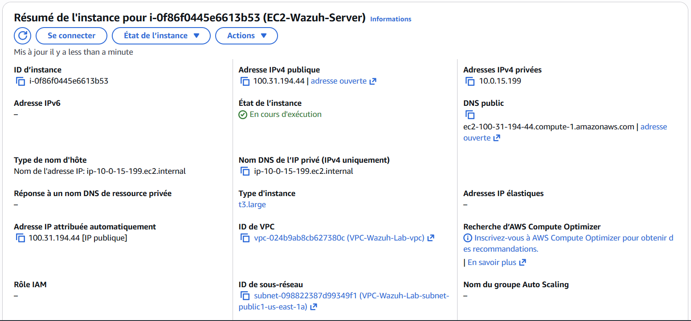

#### 2. Linux Client (Ubuntu 22.04 LTS)

- **Rôle:** Agent Wazuh – envoie les logs système et de sécurité vers le serveur central
- **Emplacement:** Subnet public (10.0.0.0/20)
- **Ports ouverts / Security Group:**
  - 22/TCP: SSH (administrateur uniquement)
  - 1514/1515/TCP: Communication avec le serveur Wazuh
- **Accès Internet:** Oui, via Internet Gateway

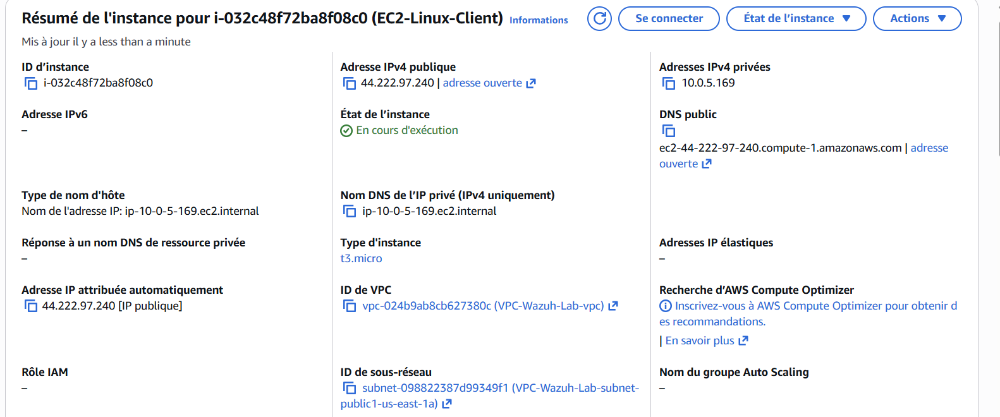

#### 3. Windows Client (Windows Server 2025/11)

- **Rôle:** Agent Wazuh + Sysmon – collecte les événements de sécurité et activités système
- **Emplacement:** Subnet public (10.0.0.0/20)
- **Ports ouverts / Security Group:**
  - 3389/TCP: RDP (administrateur uniquement)
  - 1514/1515/TCP: Communication avec le serveur Wazuh
- **Accès Internet:** Oui, via Internet Gateway

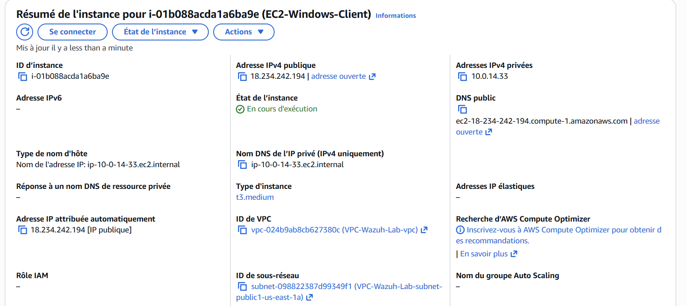

### Diagramme d'Architecture Réseau

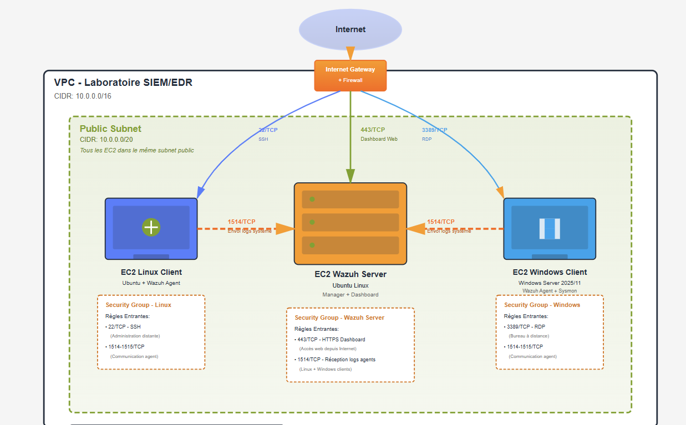

**Composants de l'architecture:**
- **VPC (10.0.0.0/16):** Réseau virtuel isolé
- **Public Subnet (10.0.0.0/20):** Sous-réseau accessible depuis Internet
- **Internet Gateway & Firewall:** Accès sécurisé depuis Internet
- **Security Groups:** Contrôle des flux entrants et sortants

## Prérequis

### Compte et Ressources AWS

- Compte AWS actif
- Accès au service EC2
- Connaissance de base des VPC et Security Groups
- Clé SSH pour l'accès aux instances

### Connaissances Requises

- Administration Linux (commandes de base, SSH)
- Administration Windows (RDP, PowerShell)
- Concepts de sécurité réseau
- Notions de cybersécurité (logs, événements, alertes)

### Logiciels Nécessaires

- Client SSH (OpenSSH, PuTTY)
- Client RDP (Remote Desktop)

## Installation et Configuration

### Étape 1: Déploiement de l'Infrastructure AWS

#### 1.1 Création du VPC

```bash
# Configuration VPC
CIDR: 10.0.0.0/16
Subnet Public: 10.0.0.0/20
```

#### 1.2 Création des Instances EC2

**Wazuh Server:**
- AMI: Ubuntu 22.04 LTS
- Type: t2.medium (minimum recommandé)
- Storage: 50 GB
- Security Group: Ports 443, 1514, 1515

**Linux Client:**
- AMI: Ubuntu 22.04 LTS
- Type: t2.micro
- Security Group: Ports 22, 1514, 1515

**Windows Client:**
- AMI: Windows Server 2025
- Type: t2.medium
- Security Group: Ports 3389, 1514, 1515

### Étape 2: Installation du Serveur Wazuh All-in-One

#### 2.1 Connexion au Serveur

```bash
# Connexion SSH au serveur Wazuh
ssh -i lab-key.pem ubuntu@3.227.17.135
```

#### 2.2 Mise à Jour du Système

```bash
# Mise à jour des paquets
sudo apt update && sudo apt upgrade -y
```

#### 2.3 Installation de Wazuh

```bash
# Téléchargement du script d'installation
curl -sO https://packages.wazuh.com/4.7/wazuh-install.sh

# Installation du serveur All-in-One
sudo bash ./wazuh-install.sh -a
```

**Note:** Le script installe automatiquement:
- Wazuh Manager
- Wazuh Indexer
- Wazuh Dashboard

#### 2.4 Récupération des Identifiants

```bash
# Les identifiants sont affichés à la fin de l'installation
# Format:
# Username: admin
# Password: <generated_password>
```

**Conservez précieusement ces identifiants!**

#### 2.5 Vérification des Services

```bash
# Vérification du Manager
sudo systemctl status wazuh-manager

# Vérification de l'Indexer
sudo systemctl status wazuh-indexer

# Vérification du Dashboard
sudo systemctl status wazuh-dashboard
```
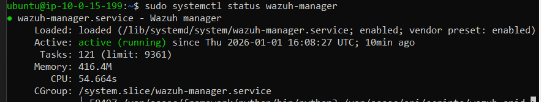
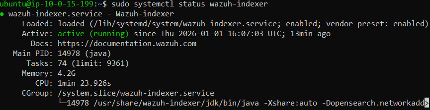
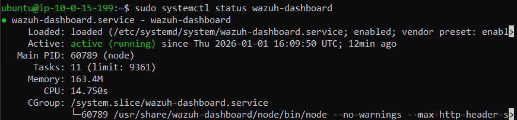


#### 2.6 Accès au Dashboard

```
URL: https://3.227.17.135:443
Username: admin
Password: <generated_password>
```

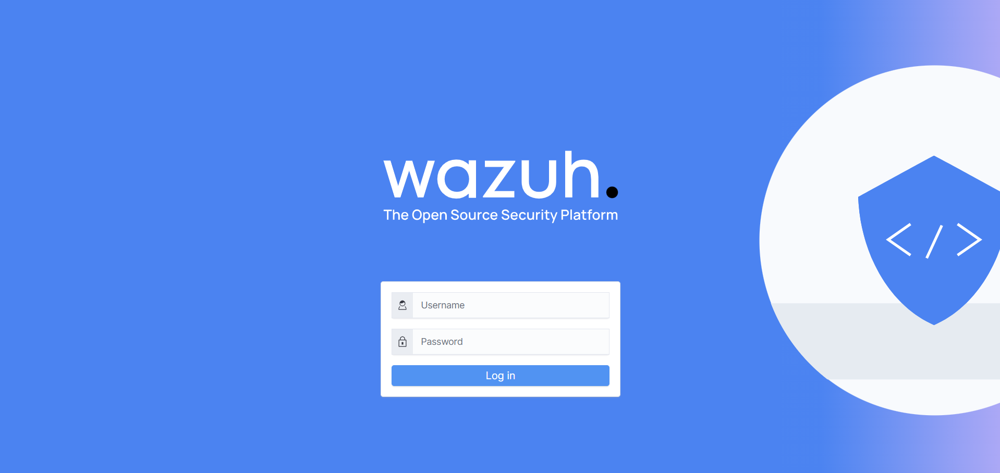

### Étape 3: Enrôlement des Agents Wazuh

#### 3.1 Agent Linux (Ubuntu)

**Depuis le Dashboard Wazuh:**

1. Naviguez vers **Agents** → **Add Agent**
2. Sélectionnez **Linux** comme système d'exploitation
3. Renseignez les informations:
   - **Server Address:** IP du serveur Wazuh
   - **Agent Name:** linux-client
   - **Agent Group:** default

4. Copiez les commandes générées

**Sur le client Linux:**

```bash
# Connexion SSH au client Linux
ssh -i lab-key.pem ubuntu@<LINUX_CLIENT_IP>

# Installation de l'agent (commandes depuis le dashboard)
wget https://packages.wazuh.com/4.x/apt/pool/main/w/wazuh-agent/wazuh-agent_4.7.0-1_amd64.deb
sudo WAZUH_MANAGER='3.227.17.135' dpkg -i ./wazuh-agent_4.7.0-1_amd64.deb

# Démarrage de l'agent
sudo systemctl daemon-reload
sudo systemctl enable wazuh-agent
sudo systemctl start wazuh-agent

# Vérification
sudo systemctl status wazuh-agent
```

#### 3.2 Agent Windows

**Depuis le Dashboard Wazuh:**

1. Naviguez vers **Agents** → **Add Agent**
2. Sélectionnez **Windows** comme système d'exploitation
3. Renseignez les informations:
   - **Server Address:** IP du serveur Wazuh
   - **Agent Name:** windows-client
   - **Agent Group:** default

4. Copiez les commandes PowerShell générées

**Sur le client Windows:**

```powershell
# Connexion RDP au client Windows
# Ouvrir PowerShell en tant qu'Administrateur

# Téléchargement de l'agent
Invoke-WebRequest -Uri https://packages.wazuh.com/4.x/windows/wazuh-agent-4.7.0-1.msi -OutFile ${env:tmp}\wazuh-agent.msi

# Installation de l'agent
msiexec.exe /i ${env:tmp}\wazuh-agent.msi /q WAZUH_MANAGER='3.227.17.135' WAZUH_AGENT_NAME='windows-client'

# Démarrage du service
NET START WazuhSvc
```

#### 3.3 Vérification des Agents

Retournez au Dashboard Wazuh et vérifiez que les deux agents apparaissent comme **Active**.

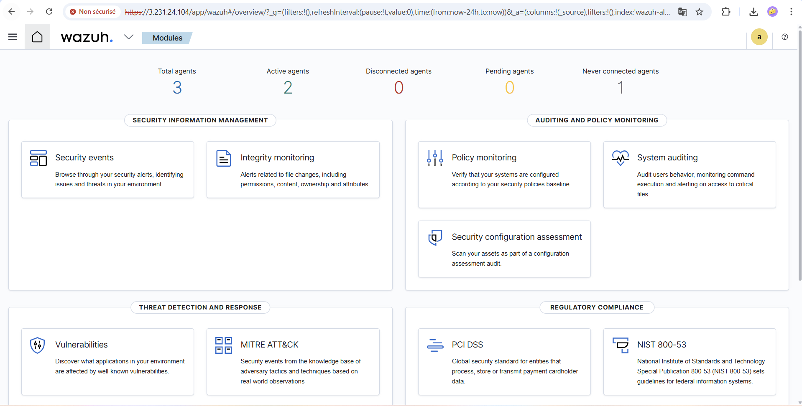

## 🧪 Scénarios de Test

### Scénario 1: Tentatives de Connexion SSH Échouées (Linux)

**Objectif:** Simuler une attaque par force brute sur SSH

**Étapes:**

```bash
# Depuis une machine distante ou le serveur Wazuh
# Tentative de connexion avec un utilisateur inexistant
ssh fakeuser@<LINUX_CLIENT_IP>
# Répéter plusieurs fois avec des mots de passe incorrects
```

**Résultat Attendu:**
- Génération d'événements `authentication failed`
- Alertes dans le dashboard Wazuh

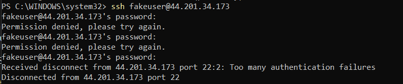

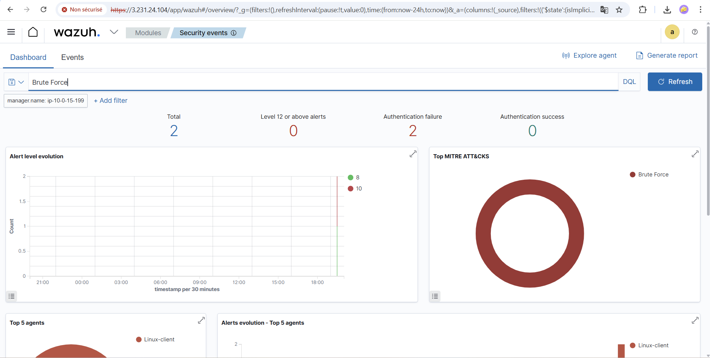

### Scénario 2: Élévation de Privilèges (Linux)

**Objectif:** Détecter l'utilisation de sudo

**Étapes:**

```bash
# Sur le client Linux
sudo su
# Exécuter quelques commandes avec sudo
sudo cat /etc/shadow
sudo systemctl restart sshd
```

**Résultat Attendu:**
- Événements `sudo` dans les logs
- Alertes d'élévation de privilèges

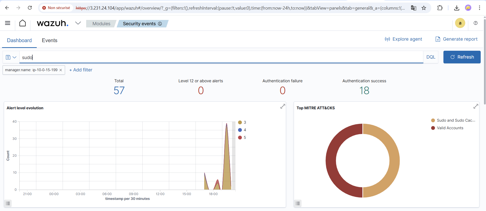

### Scénario 3: Modification de Fichier Sensible (Linux)

**Objectif:** Tester le File Integrity Monitoring (FIM)

**Étapes:**

```bash
# Sur le client Linux
sudo nano /etc/passwd
# Ajouter une ligne de commentaire
# Sauvegarder le fichier
```

**Résultat Attendu:**
- Alerte de modification du fichier `/etc/passwd`
- Détails de la modification dans le dashboard

### Scénario 4: Échecs de Connexion RDP (Windows)

**Objectif:** Détecter les tentatives de connexion non autorisées

**Étapes:**

```
1. Tenter de se connecter en RDP avec un mot de passe incorrect
2. Répéter plusieurs fois
```

**Résultat Attendu:**
- Génération d'événements `Event ID 4625` (Failed Logon)
- Alertes dans le dashboard

- Génération d'événements `Event ID 4625` (Failed Logon)
- Alertes dans le dashboard

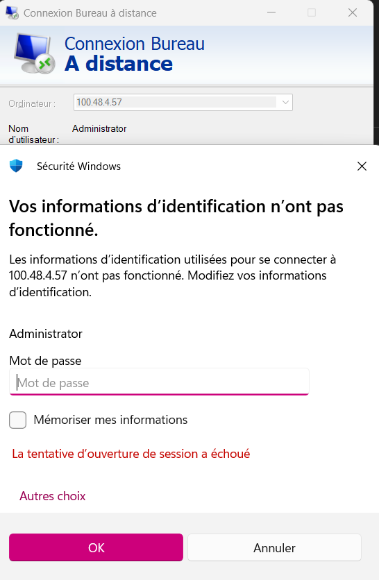

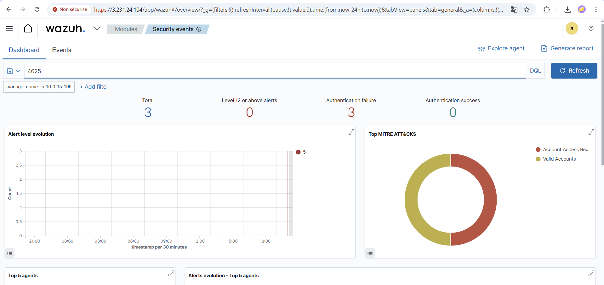

### Scénario 5: Création d'Utilisateur avec Privilèges (Windows)

**Objectif:** Détecter la création d'utilisateurs et l'attribution de privilèges

**Étapes:**

```powershell
# Sur le client Windows (PowerShell Admin)
# Création d'un nouvel utilisateur
net user testuser P@ssw0rd123 /add

# Ajout au groupe Administrators
net localgroup Administrators testuser /add
```

**Résultat Attendu:**
- Alerte de création d'utilisateur
- Alerte de modification de groupe

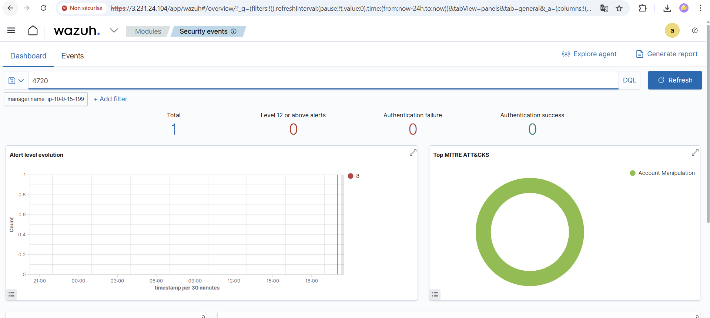


##  Résultats

### Dashboard Global

Le dashboard Wazuh centralise toutes les alertes générées par les différents scénarios:

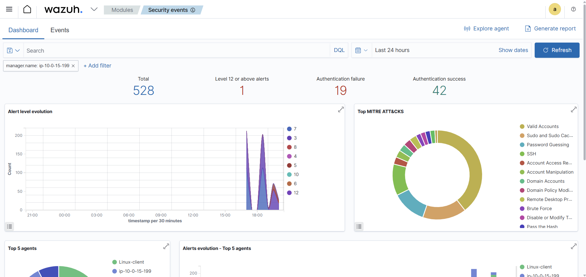

### Métriques Clés

- **Alertes SSH échouées:** Détectées et corrélées
- **Événements sudo:** Tracés avec l'utilisateur et la commande
- **Modifications FIM:** Fichiers sensibles surveillés
- **Failed Logon Windows:** Event ID 4625 capturés
- **Gestion des utilisateurs:** Créations et modifications détectées

### Analyse des Résultats

Les tests démontrent que:

1. **SIEM:** Wazuh centralise efficacement les logs multi-sources
2. **EDR:** Les agents détectent les comportements suspects sur les endpoints
3. **Corrélation:** Les événements sont analysés et contextualisés
4. **Alertes:** Les incidents sont remontés en temps réel au dashboard
5. **Forensic:** L'historique complet est conservé pour analyse

##  Conclusion

Ce projet a permis de déployer une plateforme complète de supervision et de protection des endpoints basée sur Wazuh, intégrant à la fois les concepts de SIEM et d'EDR dans un environnement multi-OS sur AWS.

### Réalisations

✅ Déploiement du serveur Wazuh All-in-One  
✅ Enrôlement des agents Linux et Windows  
✅ Génération et analyse d'incidents simulés  
✅ Observation des alertes en temps réel  
✅ Compréhension du fonctionnement d'un SOC moderne

### Compétences Acquises

- Déploiement d'infrastructure Cloud sur AWS
- Installation et configuration de solutions SIEM/EDR
- Supervision multi-OS (Linux/Windows)
- Analyse de logs et corrélation d'événements
- Détection et réponse aux incidents
- Gestion des identités et privilèges

### Perspectives

Ce projet fournit une base solide pour:
- Déployer un SOC dans un environnement de production
- Étendre la supervision à d'autres systèmes
- Intégrer des règles de détection personnalisées
- Automatiser la réponse aux incidents
- Améliorer la posture de sécurité globale

### Remerciements

Merci au Professeur **Azeddine KHIAT** pour son encadrement et son enseignement de qualité dans le module Cloud Computing et Virtualisation.

---

**École Normale Supérieure de l'Enseignement Technique de Mohammedia**  
**Université Hassan II Casablanca**  
**Département Mathématique et Informatique**  
**Cycle d'ingénieur - Filière CCN**  
**Année Universitaire 2025/2026**

---

## Ressources

- [Documentation Wazuh](https://documentation.wazuh.com/)
- [AWS EC2 Documentation](https://docs.aws.amazon.com/ec2/)
- [SIEM Best Practices](https://www.sans.org/white-papers/)
- [MITRE ATT&CK Framework](https://attack.mitre.org/)

##  Licence

Ce projet a été réalisé dans un cadre académique à l'ENSET Mohammedia.

---

*Pour toute question ou suggestion, n'hésitez pas à contribuer ou ma contacter.*
